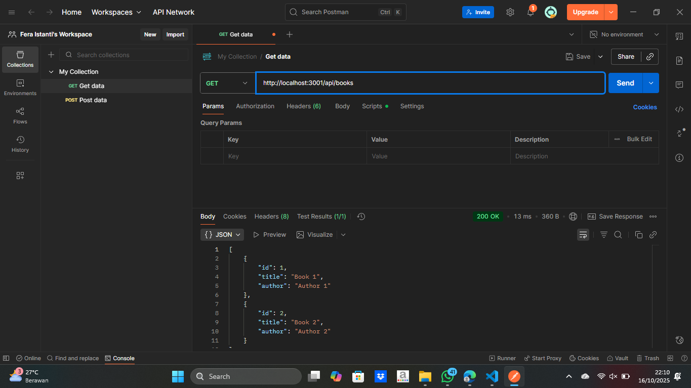
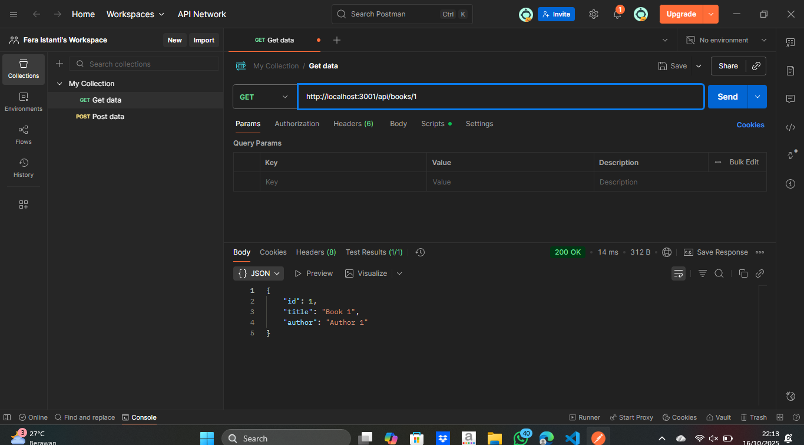
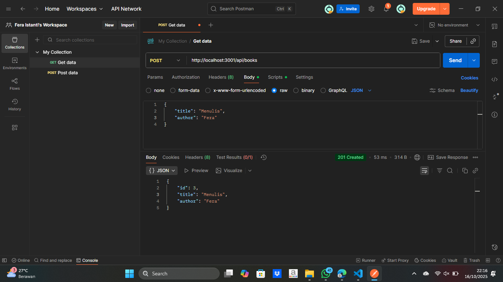
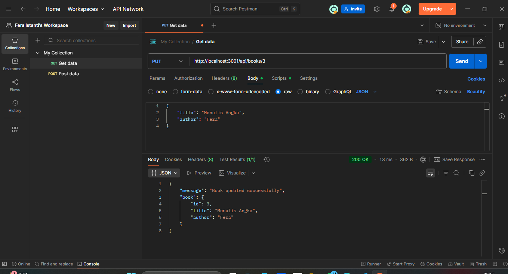
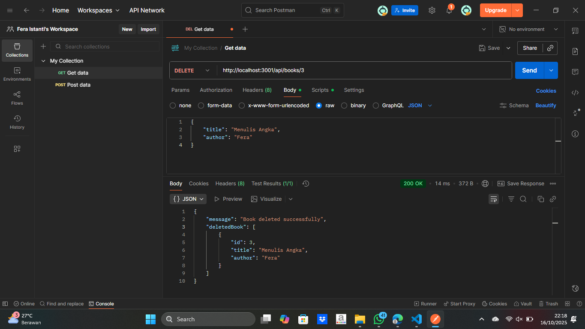
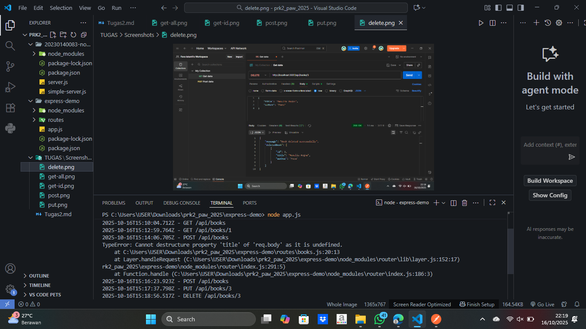
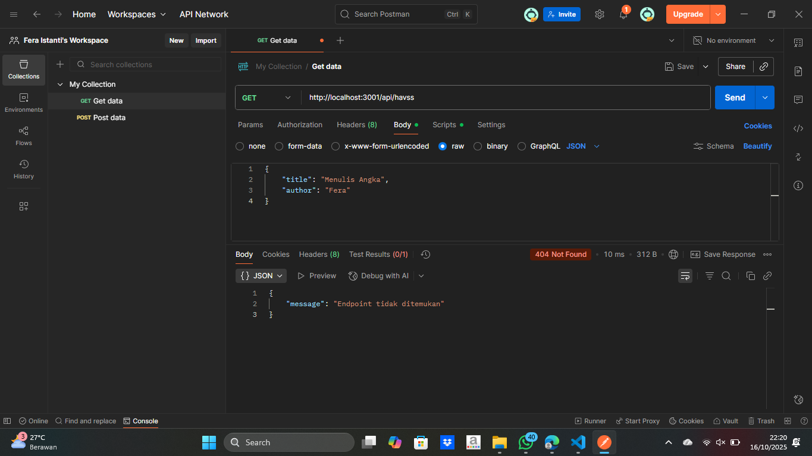
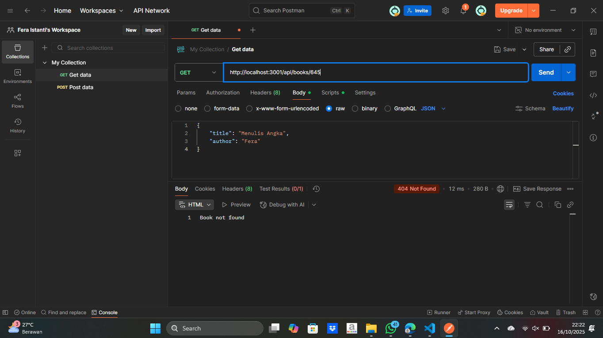

# Tugas 2 - Membuat Server HTTP dengan Node.js dan Express.js

*Nama:* Fera istanti
*NIM:* 20230140083 
*Kelas:* b 

---

## Screenshots Hasil Praktikum

### 1. GET All Books

### 2. GET Book by ID

### 3. POST Book

### 4. PUT Book

### 5. DELETE Book

### 6. Middleware Logging

### 7. Error Handling 404

### 8. Book Not Found
